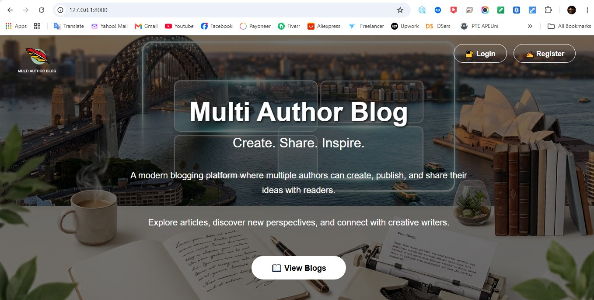
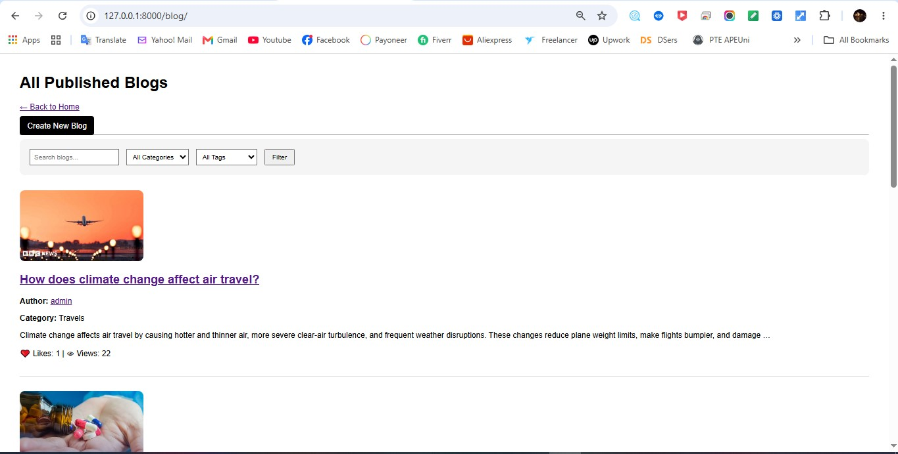
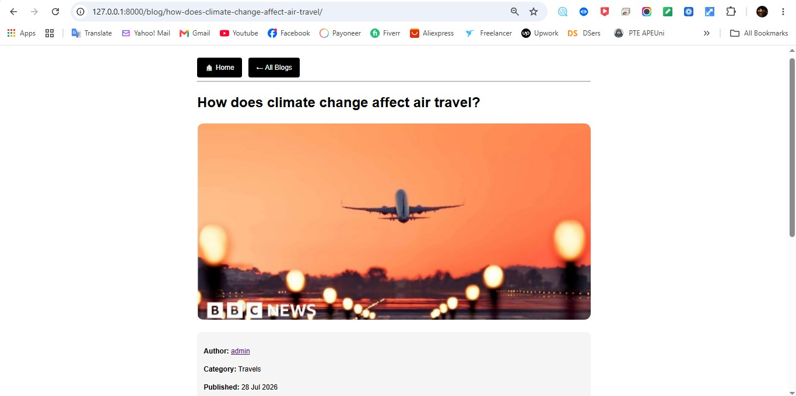
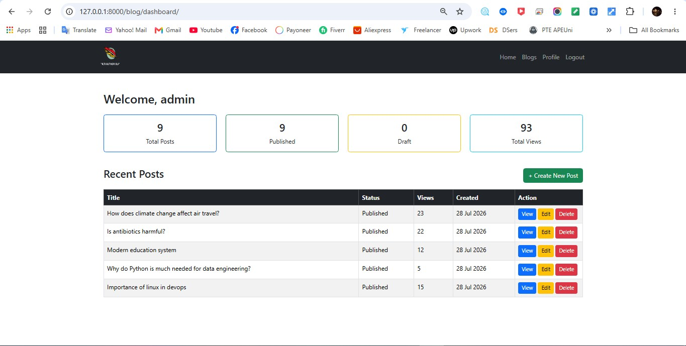
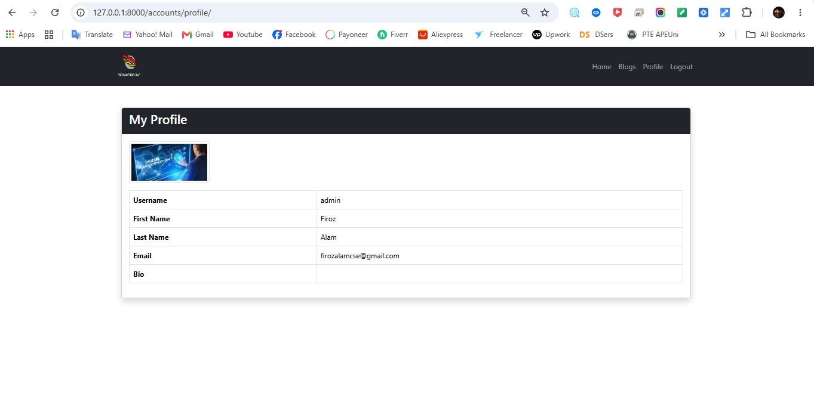
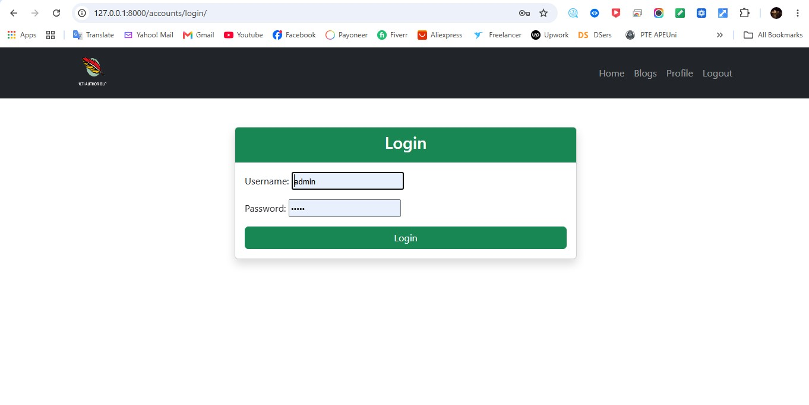
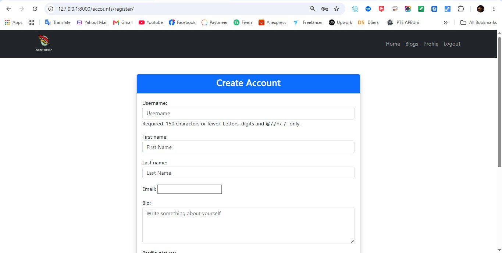

# 🚀 Multi-Author Blogging Platform

A full-featured **multi-author blogging platform** built with Django.

This project allows multiple authors to create, manage, and publish blog posts with categories, tags, comments, likes, search, filtering, pagination, and author dashboards.

The platform provides a complete blogging experience with authentication, content management, and author-based permissions.

---

# ✨ Project Features

## 🔐 Authentication System

- User Registration
- Login / Logout
- Secure authentication system
- Custom User Model
- Author-based permissions
- Protected author actions

---

# 📝 Blog Management

Authors can:

- Create blog posts
- Update blog posts
- Delete blog posts
- Save posts as Draft
- Publish blog posts
- Upload featured images
- Generate automatic slugs
- Track blog views

Blog information includes:

- Title
- Content
- Author
- Category
- Tags
- Featured Image
- Created Date
- Updated Date
- View Count
- Like Count

---

# 📂 Category & Tag System

Features:

- Create categories
- Assign categories to blogs
- Add multiple tags
- Filter blogs by category
- Filter blogs by tag

---

# 🔍 Search & Pagination

Users can search blogs by:

- Blog title
- Blog content
- Category name
- Tag name

Additional features:

- Pagination for blog listing
- Optimized blog browsing experience

---

# 👤 Author Dashboard

Each author has a personal dashboard showing:

- Total posts
- Published posts
- Draft posts
- Total views
- Recent posts

---

# 💬 Comment System

Features:

- Authenticated users can comment
- Display comments on blog details page
- Show comment timestamps
- User-based comments

---

# ❤️ Like System

Features:

- Like blog posts
- Unlike blog posts
- Display total likes
- Prevent duplicate likes

---

# 👨‍💻 Public Author Profile

Each author has a public profile page displaying:

- Author username
- Published blog posts
- Total published posts
- Total views
- Total likes received

---

# 🛠️ Django Admin Panel

Customized admin management for:

- Blog posts
- Categories
- Tags
- Comments
- Users

Admin features:

- Search
- Filtering
- Content management

---

# 🎨 User Interface

The project includes:

- Professional landing page
- Responsive navigation bar
- Logo branding
- Blog listing page
- Blog detail page
- Authentication pages
- Clean Bootstrap-based design

---

# 🛠️ Technologies Used

## Backend

- Python
- Django 6.0.7

## Frontend

- HTML5
- CSS3
- Django Templates
- Bootstrap 5

## Database

- SQLite3

## Additional Tools

- Pillow (Image Processing)
- python-decouple (.env management)

---

# 📂 Project Structure

```text
MultiAuthorBlog/

│
├── accounts/
│   ├── models.py
│   ├── views.py
│   ├── forms.py
│   └── urls.py
│
├── blog/
│   ├── models.py
│   ├── views.py
│   ├── forms.py
│   ├── urls.py
│   └── templates/
│
├── config/
│   ├── settings.py
│   ├── urls.py
│   └── wsgi.py
│
├── templates/
│
├── static/
│
├── media/
│
├── requirements.txt
├── manage.py
├── README.md
└── .env
```


# ⚙️ Installation & Setup

## 1. Clone Repository

```bash
git clone https://github.com/firozalamcse/MultiAuthorBlog.git

cd MultiAuthorBlog
```

---

## 2. Create Virtual Environment

```bash
python -m venv env
```

Activate virtual environment:

### Windows

```bash
env\Scripts\activate
```

---

## 3. Install Dependencies

```bash
pip install -r requirements.txt
```

---

## 4. Environment Configuration

Create a `.env` file in the project root:

```env
SECRET_KEY=your_secret_key
DEBUG=True
ALLOWED_HOSTS=127.0.0.1,localhost
```

---

## 5. Apply Database Migration

```bash
python manage.py makemigrations
```

```bash
python manage.py migrate
```


---

## 6. Create Superuser

```bash
python manage.py createsuperuser
```

---

## 7. Run Development Server

```bash
python manage.py runserver
```

Open your browser:

```
http://127.0.0.1:8000/
```

```
http://127.0.0.1:8000/blog/dashboard/
```

---
<h2>📸 Screenshots</h2>

<h3>🏠 Home Page</h3>


<h3>📝 Blog List Page</h3>


<h3>📄 Blog Detail Page</h3>


<h3>📊 Author Dashboard</h3>


<h3>👤 Profile Page</h3>


<h3>🔐 Login Page</h3>


<h3>📝 Register Page</h3>


---

# 🔮 Future Improvements

- Rich text editor integration
- Email notifications
- Social media sharing
- REST API development
- React frontend integration
- Advanced recommendation system

---

# 📌 Learning Outcomes

Through this project, I practiced:

- Django MVT architecture
- Authentication system
- Custom User Model
- CRUD operations
- Model relationships
- File upload handling
- Search and filtering
- Pagination
- Database migrations
- Git and GitHub workflow

---

# 👨‍💻 Author


**Firoz Alam**

Software Developer

Full Stack Web Development with Python, Django & React, and modern web technologies.


---

# 📄 License

© 2026 All Rights Reserved by Multi Author Blog